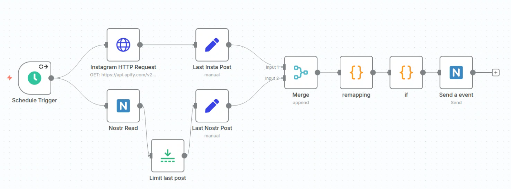
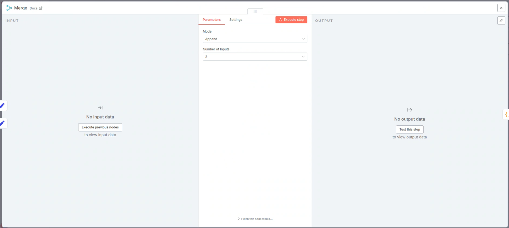
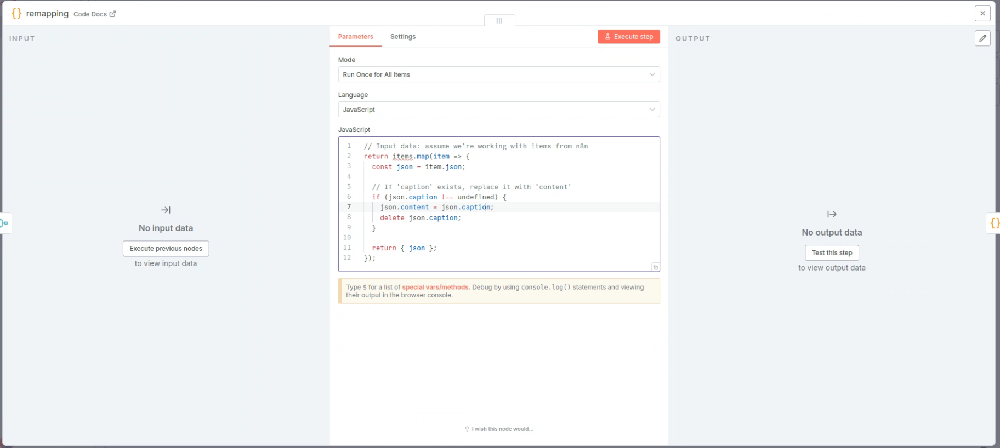
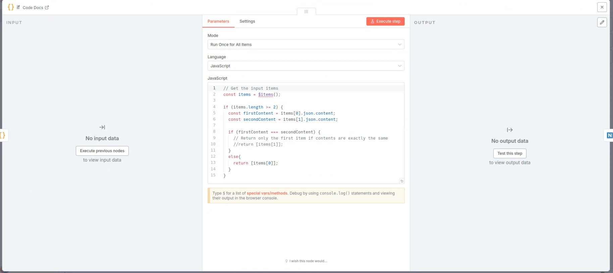

# n8n Nostr Bot documentation

</img>
<a href="https://opensource.org/licenses/MIT" title="License: MIT"></img></a>

## Introduction
This is a simple Nostr Bot crossposting text from Instrgam on Nostr. It should be a good starting point to build a custom Nostr Bot application with n8n.
 
This application is build using the <a href="https://github.com/ocknamo/n8n-nodes-nostrobots?tab=readme-ov-file">n8n-nodes-nostrobots</a>.

## Requirements

see more

- n8n installed (either locally or via the cloud)
  
-------
  
If you want to run it locally for free I recommend using docker.
 

### <u>Install docker (may change, depending on your OperatingSystem)</u> 
`sudo apt install docker.io`

### <u>Install n8n</u>
`docker run -d --name n8n -p 5680:5678 n8nio/n8n`
 After this you can open n8n in your browser at http://localhost:5680

### <u>Helpfull docker commands</u>
List all active containers (get ContainerID): 
`docker ps -a`

Stop container 
`docker stop replaceWithContainerID` 
`docker rm replaceWithContainerID`

Restart 
`docker restart n8n`

## Guide

see more

1. You first need to install the nostrobots nodes 
https://github.com/ocknamo/n8n-nodes-nostrobots?tab=readme-ov-file 
https://docs.n8n.io/integrations/community-nodes/installation/manual-install/

2. Then get a API token from api.apify to scrape instagram  
https://apify.com/apify/instagram-scraper

3. Create a Nostr account to gain the nsec and npub key

4. Download the this template (bot.json) and upload it in n8n.
   
Or rebuild the nodes as seen in the overview picture. See greater detail by unfloding the screenshots.
You can also copy all code used in the "code snipets" folder for faster rebuild.

5. Customize:

- Set a Instagram Username
- Add tokens for Instaagram
- Enter the npub and nsec for the nostr nodes

## Screenshots

see more

### Top row:

### Bottom row:

### Merge:

